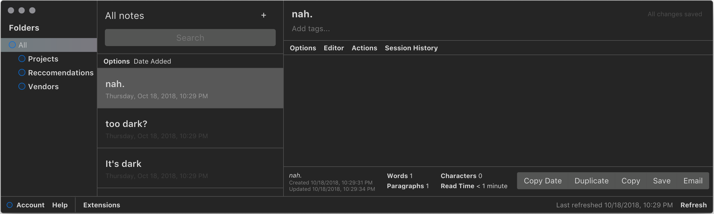

**Last Updated: 2018-10-18 22:39 @matthew-cox**

Table of Contents
=================
  * [sn-theme-mojave-dark-mode](#sn-theme-mojave-dark-mode)
  * [Revision history](#revision-history)

# sn-theme-mojave-dark-mode

For Standard Notes (https://standardnotes.org/) color theme which roughly matches Mojave Dark Mode.



Tested on macos 10.14

Installation instructions: https://docs.standardnotes.org/extensions/publishing.html

**sn-mojave-dark-mode.json**

```JSON
---
metatype: json
---

{
  "identifier": "io.github.matthew-cox.mojave-dark-mode",
  "name": "Mojave Dark Mode",
  "content_type": "SN|Component",
  "area": "themes",
  "description": "Mojave Dark Mode theme",
  "version": "v0.0.2",
  "url": "https://raw.githubusercontent.com/matthew-cox/sn-theme-mojave-dark-mode/master/dist/mojave-dark-mode.css",
  "download_url": "https://github.com/matthew-cox/sn-theme-mojave-dark-mode/archive/v0.0.2.zip",
  "latest_url": "https://listed.standardnotes.org/your-published-url",
  "marketing_url": "https://github.com/matthew-cox/sn-theme-mojave-dark-mode",
  "thumbnail_url": "https://github.com/matthew-cox/sn-theme-mojave-dark-mode/raw/master/preview.png"
}

```

# Revision history

  * v0.0.2: Add `package.json`
  * v0.0.1: Tolerable
